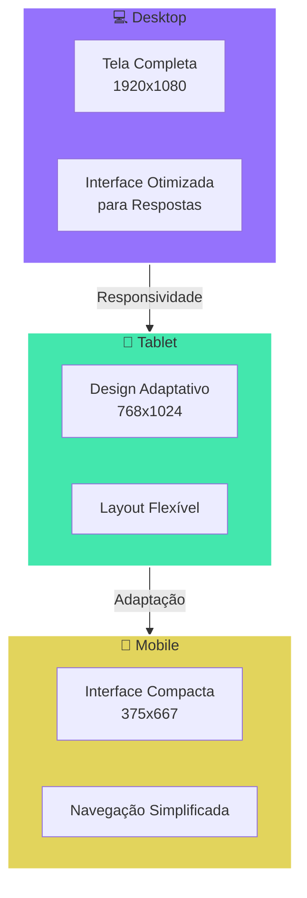

# 🎮 NLW E-Sports - Assistente de Meta

Um assistente inteligente para jogadores que fornece informações sobre estratégias, builds e dicas para diversos jogos, alimentado pela API do Google Gemini.

## 📱 Layout Responsivo

O projeto foi desenvolvido com foco em uma experiência consistente em todos os dispositivos:

### 💻 Desktop (1920x1080)

- Layout completo com espaço otimizado
- Visualização ampla das respostas
- Efeitos visuais e animações completas
- Interface com gradientes e efeitos de glass morphism
- Suporte a múltiplas perguntas na tela

### 📱 Tablet (768x1024)

- Design adaptativo mantendo a usabilidade
- Reorganização inteligente dos elementos
- Manutenção dos efeitos visuais principais
- Experiência similar ao desktop com ajustes de escala

### 📱 Mobile (375x667)

- Interface simplificada e amigável
- Layout em coluna para melhor navegação
- Otimização para toque e interação móvel
- Foco em performance e carregamento rápido
- Adaptação para diferentes orientações (retrato/paisagem)

## 🎨 Preview do Projeto

_O projeto se adapta perfeitamente a diferentes tamanhos de tela_

### 📊 Diagrama de Responsividade

### 🎯 Características Responsivas

- **Breakpoints Principais:**

  - Desktop: > 1024px
  - Tablet: 768px - 1024px
  - Mobile: < 768px

- **Adaptações Automáticas:**
  - Redimensionamento de imagens
  - Reorganização de layouts
  - Ajuste de fontes
  - Otimização de espaçamentos
  - Simplificação de animações em dispositivos móveis

## 🛠️ Tecnologias

- HTML5
- CSS3 (Layout Responsivo)
- JavaScript
- Google Gemini API

## 🔥 Funcionalidades

- 🎯 Respostas específicas para cada jogo
- 💡 Dicas de builds e estratégias atualizadas
- 📱 Design responsivo para todos os dispositivos
- ⚡ Integração com IA avançada

## 🚀 Como usar

1. Clone este repositório
2. Abra o `index.html` em seu navegador
3. Insira sua API Key do Google Gemini
4. Selecione um jogo
5. Faça sua pergunta e receba dicas personalizadas!

## 📝 Licença

Este projeto está sob a licença MIT. Veja o arquivo [LICENSE](LICENSE) para mais detalhes.

---

Feito com muita atenção durante o NLW da Rocketseat 🚀
