# 🎮 NLW E-Sports - Assistente de Meta

Um assistente inteligente para jogadores que fornece informações sobre estratégias, builds e dicas para diversos jogos, alimentado pela API do Google Gemini.

## 📱 Layout Responsivo

O projeto foi desenvolvido com foco em uma experiência consistente em todos os dispositivos:

- 💻 **Desktop**: Layout completo com espaço otimizado para visualização de respostas
- 📱 **Tablet**: Design adaptativo mantendo a usabilidade
- 📱 **Mobile**: Interface simplificada e amigável para telas pequenas

## 🛠️ Tecnologias

- HTML5
- CSS3 (Layout Responsivo)
- JavaScript
- Google Gemini API

## 🔥 Funcionalidades

- 🎯 Respostas específicas para cada jogo
- 💡 Dicas de builds e estratégias atualizadas
- 📱 Design responsivo para todos os dispositivos
- ⚡ Integração com IA avançada

## 🎨 Preview

O projeto se adapta perfeitamente a diferentes tamanhos de tela:

```mermaid
graph TD
    subgraph Desktop["💻 Desktop View"]
        D["+-----------------+<br/>|    E-SPORTS     |<br/>|     <nlw/>      |<br/>|  +-----------+  |<br/>|  | API KEY    |  |<br/>|  +-----------+  |<br/>|  | Game Select |  |<br/>|  +-----------+  |<br/>|  | Question    |  |<br/>|  +-----------+  |<br/>|  [  PERGUNTAR  ]  |<br/>+-----------------+"]
    end

    subgraph Tablet["📱 Tablet View"]
        T["+--------------+<br/>|   E-SPORTS    |<br/>|    <nlw/>     |<br/>|  +--------+   |<br/>|  |API KEY |   |<br/>|  +--------+   |<br/>|  |Select  |   |<br/>|  +--------+   |<br/>|  |Question|   |<br/>|  +--------+   |<br/>|  [PERGUNTAR]   |<br/>+--------------+"]
    end

    subgraph Mobile["📱 Mobile View"]
        M["+---------+<br/>| E-SPORTS |<br/>|  <nlw/>  |<br/>| +-----+ |<br/>| |API  | |<br/>| +-----+ |<br/>| |Game | |<br/>| +-----+ |<br/>| |Quest| |<br/>| +-----+ |<br/>| [ASK]   |<br/>+---------+"]
    end

    style Desktop fill:#2a2634,stroke:#9572fc,stroke-width:2px
    style Tablet fill:#2a2634,stroke:#43e7ad,stroke-width:2px
    style Mobile fill:#2a2634,stroke:#e2d45c,stroke-width:2px
```

## 🚀 Como usar

1. Clone este repositório
2. Abra o `index.html` em seu navegador
3. Insira sua API Key do Google Gemini
4. Selecione um jogo
5. Faça sua pergunta e receba dicas personalizadas!

## 📝 Licença

Este projeto está sob a licença MIT. Veja o arquivo [LICENSE](LICENSE) para mais detalhes.

---

Feito com muita atenção durante o NLW da Rocketseat 🚀
